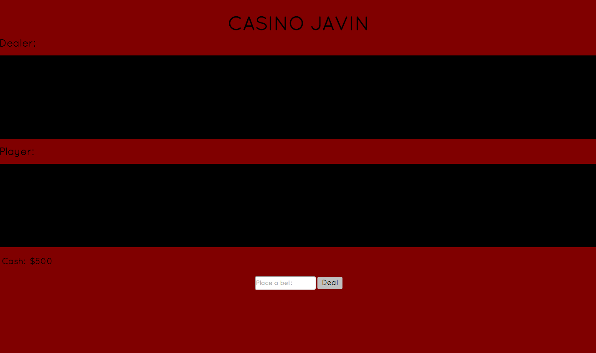
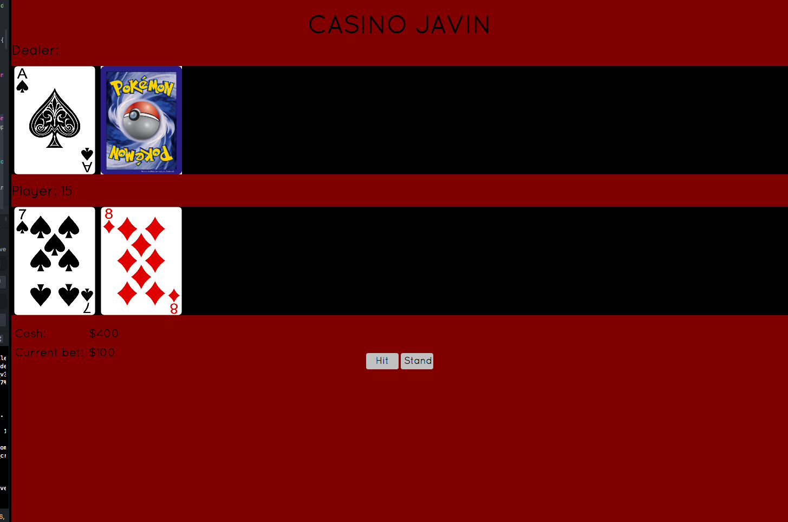
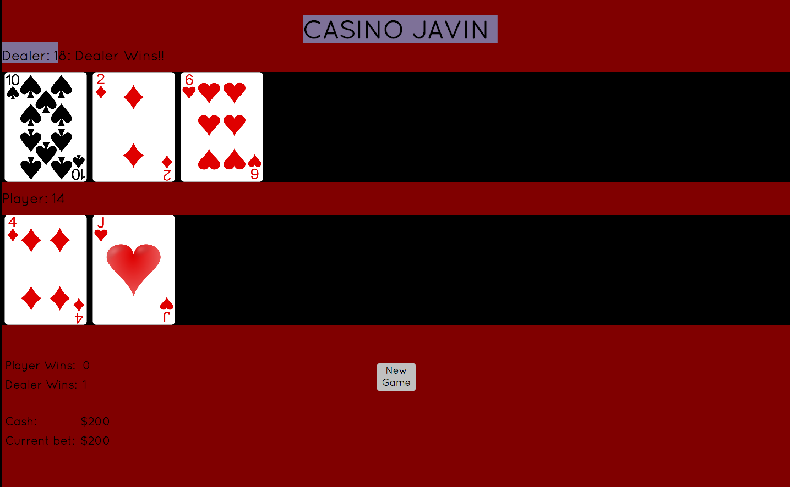

## Blackjack/Casino Javin

#### Website:  (http://time_for_blackjack.surge.sh)

#### Contents:

##### Overview 
##### Technologies
##### Contributors 
##### Example Code

#### Overview:
As an exercise in Object Oriented programming, test driven development, and JQuery, the project challenged us to design a blackjack game with basic functionality:
#####A button to initiate the game via card images dealt to both the dealer and player
#####Tracking of card value points with a dynamic display feature
#####Ability to Hit or Stand as a player during gameplay
#####Determining a Winner
#####Restarting the game

##### Added feautures include:
The ability to place bets and track winnings
A dealer card that is face down, along with hidden dealer points 
Card animations at deal and hit

##### Technologies:
JavaScript
JQuery
HTML
CSS

##### Object Oriented Design:
Object classes were implemented as part of functionality including:
Card Object (stores a point(numeric) value along with suit)
Hand Object (stores an array of Card objects during each hand, along with a method for totalling the points in a given hand)
Deck Object (an instance of a given deck of 52 cards, including a shuffle and card draw method)

###### Test Driven Development:
Object classes and other functionality was developed by writing and implementing tests in Jasmine testing environment.

##### Contributors:
Jason Campbell
Kevin Farmer

##### Example Code:

The Deck Object:

```

function Deck(){
  this.cards = [];
  for (i=1; i<14; i++) {
    this.cards.push(new Card(i,'spades'));
    this.cards.push(new Card(i,'hearts'));
    this.cards.push(new Card(i,'clubs'));
    this.cards.push(new Card(i,'diamonds'));
  }
}

```
The Shuffle Method

```

Deck.prototype.shuffle = function(){
  var m = this.cards.length, temp, index;
  while (m) {

    index = Math.floor(Math.random() * m--);

    temp = this.cards[m];
    this.cards[m] = this.cards[index];
    this.cards[index] = temp;
  }
  return this.cards;
};

```

Screen shot:




